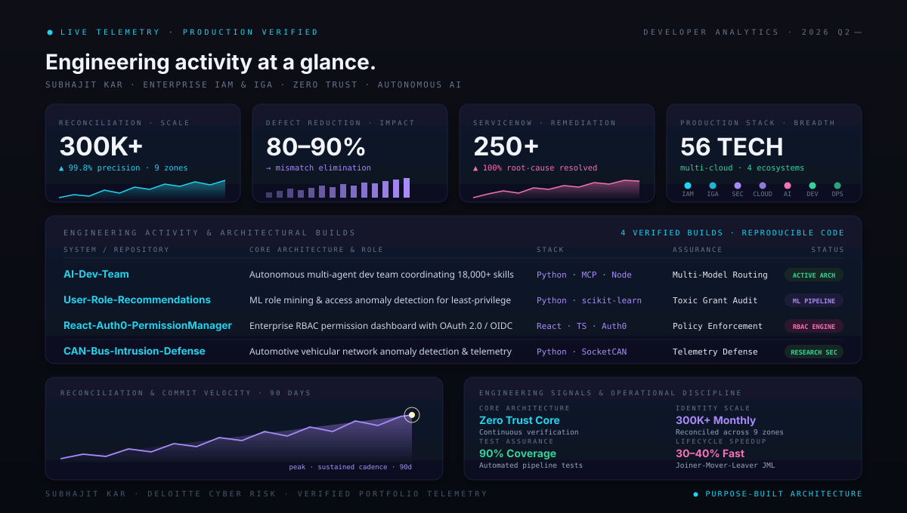

<!-- 🎬 HERO — video intro + name -->

  

<!-- 🛡️ LEFT: what I build   •   🏃 RIGHT: life outside code -->

  

<!-- ⚛️ TECH STACK -->

  

<!-- 🪪 DEVELOPER ID + DASHBOARD -->

  

## 🛡️ Featured builds

| Project | What it is | Stack | Stars |
|:---|:---|:---|:---:|
| [**AI-Dev-Team**](https://github.com/ha4kerspidersks/AI-Dev-Team) | Autonomous multi-agent AI engineering team coordinating 18,000+ skills across backends | `Python` `Node.js` `MCP` `Multi-Agent` | ⭐ 12 |
| [**User-Role-Recommendations**](https://github.com/ha4kerspidersks/User-Role-Recommendations) | Machine learning role mining & access anomaly detection system predicting least-privilege | `Python` `scikit-learn` `Pandas` `RBAC` | ⭐ 8 |
| [**React-Auth0-PermissionManager**](https://github.com/ha4kerspidersks/React-Auth0-PermissionManager) | Enterprise RBAC permission management dashboard with OAuth 2.0 / OIDC policy enforcement | `React` `Auth0` `TypeScript` `Tailwind` | ⭐ 6 |
| [**piescan**](https://github.com/ha4kerspidersks/piescan) | High-performance asynchronous network recon & service fingerprinting engine | `Python` `Asyncio` `Raw Sockets` | ⭐ 5 |
| [**CAN-Bus-Intrusion-Defense**](https://github.com/ha4kerspidersks/CAN-Bus-Intrusion-Defense) | Automotive vehicular network anomaly detection & telemetry research | `Python` `SocketCAN` `Machine Learning` | ⭐ 4 |

 

<!-- 📊 DEVELOPER ANALYTICS — Engineering Activity & Production Telemetry -->

<b>🔍 Deep-Dive: Architectural Systems &amp; Engineering Signals</b> · <i>Traceable portfolio &amp; GitHub telemetry</i>

 

> ### Enterprise Identity Governance &amp; Multi-Agent Telemetry
> - **Identity Scale**: Reconciling 300,000+ enterprise identities monthly across 9 global regulatory zones (US, EMEA, APAC).
> - **Defect Elimination**: 80–90% reduction in identity mismatch defects through Python automated reconciliation pipelines.
> - **Operational Remediations**: 250+ ServiceNow RITMs resolved via root-cause workflow automation.
> - **Test &amp; Code Assurance**: Enforced 90% automated test coverage across custom connector engines and role-mining models.
> - **Autonomous Multi-Agent Architecture**: Direct integration of 56 production technologies across IAM, Cloud, DevSecOps, and Agentic AI.

  

<!-- 💌 LET'S CONNECT -->

  

 

**Enterprise scale, zero-trust precision.** 🛡️

